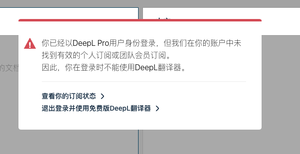

# 常见问题

这里列出了一些常见的问题，如果这里面没有你遇到的问题、或者不能解决你的问题，你可以[将问题反馈给我](issues.mdx)。

## 划词翻译会侵犯我的隐私吗？ {#safe}

我 2013 年发布了划词翻译（[查看划词翻译大事记](histroy.md)），在 2020 年发布 v7.0 版本之前，划词翻译的代码是在[全球最大的程序员网站 GitHub 上开源的](https://github.com/lmk123/crx-selection-translate)。也正因为如此，在划词翻译 35 万的用户当中，有很大一部分是程序员，即使 v7.0 版本之后没有开源了，但如果划词翻译做出了侵犯隐私的事情，程序员也有办法发现。

划词翻译只会将你划选的文本这一个信息发送给翻译服务器。除非你主动开启了[历史记录](guides/history.md)或将翻译结果加入了[收藏夹](guides/fav.md)，否则划词翻译不会保存此文本的关联信息，例如你划选这段文本的网址、这段文本的上下文等。除非你启用了数据同步，否则历史记录和收藏夹只会保存在你的浏览器中，不会上传到划词翻译的服务器。

你申请的密钥只会保存在浏览器中，即使开启了数据同步也不会上传。

划词翻译默认开启了【自动读取剪切板】功能，这是为了方便你打开[独立翻译窗口](guides/standalone.md)和[扩展弹出页](guides/popup.md)时自动读取剪切板并翻译，省去粘贴的操作。这个功能是可以在[设置页](guides/options.md)里关闭的。

## 如何翻译 PDF 文件？ {#how-pdf}

请查看[翻译 PDF 文件](guides/pdf.md)。

## 为何在本地打开的 html、txt 文件里（即以 file:// 开头的网址）里失效？ {#file-url}

如果你是 Chrome 或 Edge 浏览器，你需要在扩展程序页面勾选“允许访问文件网址”。步骤：

1. 右键单击浏览器地址栏右边的划词翻译图标，选择 "管理扩展"
2. 在打开的页面中勾选"允许访问文件网址"

如果你是 Firefox 浏览器，由于 Firefox 不提供本地文件的权限，所以无法做到在本地文件里使用，但你可以在复制文本后，点击地址栏右侧的划词翻译图标（或使用快捷键打开）使用。你还可以使用[独立翻译窗口](guides/standalone.md)。

## 为什么谷歌翻译经常提示“谷歌翻译暂时不可用，请稍后再试。”？ {#why-google-crash}

~~这是谷歌翻译服务器做的限制：如果同一个 IP 地址在一段时间内频繁使用谷歌翻译的话，谷歌翻译服务器就会暂时停止提供翻译结果。如果你用过[官方的谷歌翻译扩展程序](https://chrome.google.com/webstore/detail/aapbdbdomjkkjkaonfhkkikfgjllcleb)，就会发现它也是有这个问题的。一般情况下，这个情况在半小时内就会恢复，或者你也可以用高科技工具换一个 IP 地址再使用。~~

此问题已在 v7.4.1 解决，如果遇到了这个问题，请确认你的划词翻译版本是否是最新的。

## 为什么谷歌翻译的翻译结果跟翻译网站里的不一样？ {#why-result-different}

使用谷歌翻译时，划词翻译会从两个接口获取结果，第一个接口的翻译结果跟 [translate.google.cn](https://translate.google.cn) 的结果是一致的，但是如果在一段时间内超出使用频率就不让用了，此时划词翻译会从第二个接口获取翻译结果。第二个接口没有使用频率限制，但是翻译结果可能会跟 [translate.google.cn](https://translate.google.cn) 不一样。

我已经计划在未来的版本中换一种获取谷歌翻译结果的方式以确保翻译结果一致，你可以在 [#968](https://github.com/lmk123/crx-selection-translate/issues/968) 查看进展。

## 修改快捷键后没有生效 {#edit-shortcut-key}

这是 Chrome 浏览器的问题，如果设置了一个全局快捷键后想修改或删除此键，首先要把“全局”改为“在 Chrome 中”，然后修改或删除，最后再将“在 Chrome 中”改回“全局”。否则在浏览器重启之前，这个快捷键不会生效。

## 为什么翻译服务会提示"服务器没有响应"、或一直在加载中不显示翻译结果？ {#why-services-always-loading}

### 如果只有 DeepL 出现了一直加载不显示结果的问题 {#deepl-only}

首先，请确认你没有[修改划词翻译的权限范围](guides/options.md#per)。

然后，请在浏览器中尝试一下能否打开 [https://deepl.com/translator](https://deepl.com/translator)，并确保打开后的页面没有被弹窗遮挡。目前已知的会出现遮挡的情况有两种。

第一种，如果你注册了 DeepL 账号但又没有购买 DeepL Pro，那么当你打开这个地址时，界面会被如下弹窗遮挡，此时就需要你退出 DeepL 账号并刷新页面确保页面无遮挡：

第二种，当你一天内使用达到一定的次数，DeepL 会弹个窗告诉你当天已达上限，这个弹窗是无法关闭的，也就是你在当天内都无法再使用 DeepL 了。不过，这个限制只针对单个浏览器，你可以换个浏览器继续使用。

如果你能正常打开这个网址、且 DeepL 没有遮挡，但划词翻译仍然无法显示翻译结果，那么请[将问题反馈给我](issues.mdx)。

### 如果大部分翻译服务都出现了“服务器没有响应”的问题 {#proxy}

首先，请确认你没有[修改划词翻译的权限范围](guides/options.md#per)。

如果没有，那么大概率是因为你开启了代理软件，请关闭代理或将各服务的域名加入直连名单后重试。

  
点击查看各服务的域名

  <table>
    <thead>
      <tr>
        <th>服务名称</th>
        <th>服务域名</th>
      </tr>
    </thead>
    <tbody>
      <tr>
        <td>划词翻译的相关服务 （登录、注册、翻译积分等）</td>
        <td>
          <code>hs-api.limingkai.cn</code>
        </td>
      </tr>
      <tr>
        <td>必应词典</td>
        <td><code>cn.bing.com</code></td>
      </tr>
      <tr>
        <td>百度翻译</td>
        <td>
          <code>fanyi-api.baidu.com</code>
        </td>
      </tr>
      <tr>
        <td>腾讯翻译君</td>
        <td>
          <code>tmt.ap-shanghai.tencentcloudapi.com</code>
        </td>
      </tr>
      <tr>
        <td>彩云小译</td>
        <td>
          <code>api.interpreter.caiyunai.com</code>
        </td>
      </tr>
      <tr>
        <td>阿里翻译</td>
        <td>
          <code>mt.cn-hangzhou.aliyuncs.com</code>
        </td>
      </tr>
      <tr>
        <td>搜狗翻译</td>
        <td>
          <code>fanyi.sogou.com</code>
        </td>
      </tr>
      <tr>
        <td>有道翻译</td>
        <td>
          <code>openapi.youdao.com</code>
        </td>
      </tr>
      <tr>
        <td>百度通用文字识别</td>
        <td>
          <code>aip.baidubce.com</code>
        </td>
      </tr>
    </tbody>
  </table>

如果不是这个原因，请[将问题反馈给我](issues.mdx)。

## 注册 / 登录划词翻译账号时报错“服务器没有响应，请稍后重试” {#server-no-response}

首先，请确认你没有[修改划词翻译的权限范围](guides/options.md#per)。

然后，请尝试在浏览器内打开 [https://hs-api.limingkai.cn/](https://hs-api.limingkai.cn/)，如果一切正常，那么这个网址会显示 “Not Found”。

如果打不开，那么有以下几种可能：

- 你开启了代理软件。请关闭代理，或者将 `hs-api.limingkai.cn` 加入直连名单后重试。
- 划词翻译的服务器真的挂了（但是这种情况概率很低）。请[联系我](issues.mdx)告知这一情况。

如果能打开，那么确认一下浏览器地址栏开头是否有“不安全”这三个红色的字。如果有的话；

- 你可以返回划词翻译试着重新注册 / 登录账号，现在应该恢复正常了。
- 划词翻译服务器的证书过期了（但这种情况概率很低）。请[联系我](issues.mdx)告知这一情况。

## 为什么不能在某些页面如 Chrome / Firefox / Edge 扩展商店里使用？ {#why-can-not-use-in-store}

这是浏览器自身的安全策略限制，任何扩展都没有权限控制某些页面，包括但不限于：

- 浏览器的内置页面，即以 `about://`、`chrome://`、`moz://`、`edge://` 等类似协议开头的网址。
- 各浏览器的扩展商店页面，如 Chrome 不允许在 Chrome 扩展商店使用、Edge 不允许在 Edge 扩展商店使用。
- 各浏览器自己的一些其它限制，例如 Firefox 不允许在 [https://support.mozilla.org/](https://support.mozilla.org/) 里使用。

在这些页面中，唯一可以使用的方式是划选文本后，用鼠标右键点击你选中的文本，然后选择【翻译网页中选中的文本】，之后划词翻译会弹出[独立翻译窗口](guides/standalone.md)并翻译。

## 为什么划词翻译的体积有 3.5 MB 这么大？ {#fat}

这是因为为了使用上的方便，划词翻译内置了两个体积很大的功能：

- [Tesseract OCR](https://tesseract-ocr.github.io/)：用于在[截图 / 图片翻译功能](guides/screenshot.md)中将图片转为文字。
- [PDF.js](https://mozilla.github.io/pdf.js/)：用于[翻译 PDF 文件](guides/pdf.md)。

如果没有这俩功能，那么划词翻译的体积应该只有几百 KB。
